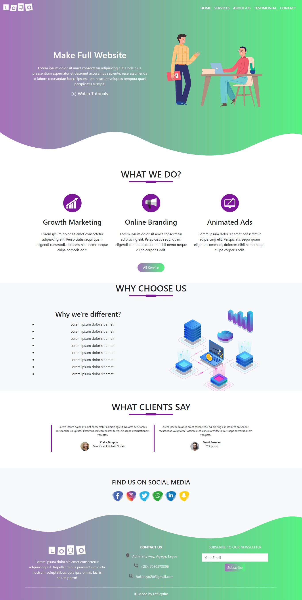
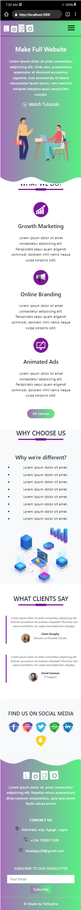

## Scythe Website
#### Link to the live website:
>[Website](https://devscythewebsite.netlify.app/ "LandingPage live site")
___

#### Description 
>A responsive landing page made with react and bootstrap
____

### Getting Started with Create React App
### `npm start`

Runs the app in the development mode.\
Open [http://localhost:3000](http://localhost:3000) to view it in your browser.


#### Tech Used:
 >React, bootstrap, git, github, Netlify.
___

> #### Things i have learnt
```JavaScript
// How to make component, use smooth scroll in react and more
import './App.css';
import Navbar from './component/Navbar';
import Hero from './component/Hero';
import Services from './component/Services';
import About from './component/About';
import Testimonial from './component/Testimonial';
import Contact from './component/Contact';
import Footer from './component/footer';

function App() {
  return (
    <main className='App'>
      <Navbar /> 
      <div id='hero'>
        <Hero />
      </div>
      <div id='services'>
        <Services />
      </div>
      <div id='about'>
        <About />
      </div>
      <div id='testimonial'>
        <Testimonial />
      </div>
      <div id='contact'>
        <Contact />
      </div>
      <div id='footer'>
      <Footer />
      </div>
    </main>
     
  );
}

export default App;

<Link
activeClass = "active"
to="contact"
spy={true}
smooth={true}
offset={-100}
duration={500}
className='text-decoration-none'
>CONTACT</Link>


```
---

> #### Desktop View


> #### Mobile View



> #### Credits: 
EasyTutorials
Scythe